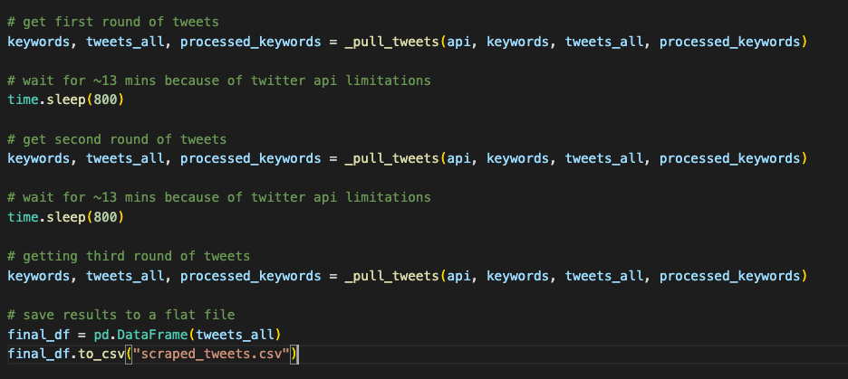

# Return to Office

## An Analysis of Sentiment and Prevalence of Remote Work vs. Telecommuting

Cassie Adams | Jason Edwards | Will Fiser | Nikola Novakovic 

# Executive Summary

Since the start of the COVID-19 pandemic in March of 2020, work from home has become a commonality of labor markets across the world. What started as a safety precaution to limit exposure to the virus responsible for over six million deaths worldwide, quickly turned into one of the most important topics of discussion for companies' competing to attract the best talent in what suddenly became a very tight labor market (New York Post, 2022). Companies must weigh the pros and cons (real or perceived) of remote work versus in-person work along with what seems to be a preference among workers for remote work to become the norm rather than the exception (The Capitalist, 2022). In our analysis, we reviewed consumer sentiment of remote and in-person work, as well as data from the Bureau of Labor Statistics examining the rate that remote work has been adopted along with Total Factor Productivity in an attempt to determine objectively whether remote work, on the whole, is a positive or negative impact to productivity.

Based on our findings, we feel companies should adopt a hybrid policy, giving employees the flexibility to choose between in-person or remote work. Doing so will allow companies to remain competitive by adopting work practices that meet worker expectations while maximizing productivity. We also feel this approach will help companies gain better access to talent compared to peers who adopt one policy over the other. According to our sentiment analaysis, consumers with a "positive" outlook tend to come from the standpoint of remote work, whereas the "negative" perception is typically from those returning to the office. In other words, the outlook gathered from our sample group is more in favor of work-from-home when compared to in-person work. Furthermore, it was determined through our analysis of data gathered from the Bureau of Labor Statistics that productivty skyrocketed when remote work adoption took off during the second quarter of 2020. Fast forward to the first quarter of 2022, productivity saw a stark decrease due to the start of return-to-office mandates. All things considered, the hybrid approach is most likely to yield incremental improvements in productivity that will offer an additional competitive edge to the adopters. Employees, meanwhile, will enjoy the benefits that remote work offers, including reduced commute time, better work-life balance, and more fulfillment in their jobs while still having the flexibility to engage in "water cooler" talks as they so please (Full Focus, 2022).

Participating in this team are Cassie Adam, Jason Edwards, Will Fiser, and Nikola Novakovic.

# Table of Contents

- [Return to Work:](#return-to-work)
  - [An Analysis of Sentiment and Prevalence of Remote Work vs. Telecommuting](#an-analysis-of-sentiment-and-prevalence-of-remote-work-vs-telecommuting)
- [Executive Summary](#executive-summary)
- [Table of Contents](#table-of-contents)
- [Statement Of Scope](#statement-of-scope)
  - [Project Objectives](#project-objectives)
  - [Unit of Analysis](#unit-of-analysis)
- [Project Schedule](#project-schedule)
- [Data Preparation](#data-preparation)
  - [Data Access](#data-access)
    - [Twitter API Access](#twitter-api-access)
    - [BLS API Access](#bls-api-access)
    - [BLS Static Table Scraping](#bls-static-table-scraping)
  - [Data Cleaning](#data-cleaning)
  - [Data Transformation](#data-transformation)
  - [Data Reduction](#data-reduction)
  - [Data Consolidation](#data-consolidation)
    - [Twitter Data](#twitter-data)
    - [BLS Data](#bls-data)
    - [Full Dataset Consolidation](#full-dataset-consolidation)
- [NEED TO UPDATE](#need-to-update)
  - [Data Dictionary](#data-dictionary)
    - [Twitter Data](#twitter-data-1)
    - [BLS Productivity Data (API)](#bls-productivity-data-api)
    - [BLS Telecommuting Data (Scraped)](#bls-telecommuting-data-scraped)
- [Analysis \& Visualizations](#analysis--visualizations)
- [Conclusion And Discussion](#conclusion-and-discussion)
  - [Links to Data Files:](#links-to-data-files)
  - [Links to Code Files:](#links-to-code-files)
- [Sources:](#sources)

# Statement Of Scope

Our purpose for this project was to develop an understanding of worker sentiment regarding remote work versus in-person work and to compare this against the respective productivity levels. This will assist companies in the decision making of talent acquisition and strategic work practices. The approach to this study was two-pronged. The first leg of the project reviewed public opinion on remote work and in-person practices by scraping the social media application Twitter based on specified keywords. The other component of this study involved in-depth analysis of data provided through the Bureau of Labor Statistics, such as the adoption rate of remote work and its associated impact on productivity. Descriptive analytics and sentiment analyses were performed to gather insights on consumer feelings and identify company recommendations to attract and retain talent in today’s ever changing market. In addition, data visualizations were created to assist our various analyses in a more condensed and easier to understand way.

## Project Objectives

This project identified consumer sentiment on remote work versus in-person work. The project also reviewed the impact that the increase in remote work in response to the COVID-19 pandemic had on employee productivity. The labor market today is much different than it was pre-pandemic, creating complexities for companies that never existed before. With an incredibly strong labor market, caused by a 50-year low in unemployment rates and approximately 1.7 job openings for every unemployed person, employees often hold leverage on companies as there are always other opportunities. With this in mind, it is important for companies to understand consumers' outlook on work-style and how the preference of remote work or in-person work can affect employee retention and the talent secured in new hires. Through this study, we are hoping to provide companies with strategic recommendations to help retain employees and capture talent in this evolving market. The objectives of the project included the following:

- Data Identification
  - Generated a list of keywords related to remote and in-person work that can be searched for and scraped from Twitter.
  - Identified data from the Bureau of Labor Statistics that provides insights on the impact of work from home versus in-person.
- Data Extraction
  - Used Twitter’s API Platform to scrape roughly 6,500 Tweets that match the keyword criteria generated during the data identification stage.
  - Web scraped the Bureau of Labor Statistics to gather reliable data relative to productivity and other work related metrics.
- Data Analytics
  - Performed a sentiment analysis on the public opinion data gathered from Twitter to determine the general feelings consumers have relative to remote work and in-person work.
  - Gained insights on the impact that remote work has on employee productivity and the adoption rate of work from home strategies.
  - Visualized data findings to assist in educated business recommendations.

## Unit of Analysis

Target Variables:

Twitter dataset contains these variables:

- created_at - represents a timestamp with date and time
- text - represents text of the tweet
- keyword - represents phrase/keyword used to query the twitter API

BLS datasets contain these variables [need to add]:

- Month - represents a calendar month
- group - represents an ethnic group or sexual orientation
- values - represents the percentage of employees
- Year - represents the calendar year
- period - represents the calendar quarter (as an acronym)
- periodName - represents the calendar quarter
- hours - represents the number of hours
- output - represents the quantity of goods or services produced in a specific time period
- productivity - represents the output per hour

# Project Schedule

Below is the GANTT Chart schedule for the Project Proposal, Deliverable 1, Deliverable 2, and Project Presentation. In the GANTT chart, each deliverable is represented by a different color which includes: Project Proposal in blue, Deliverable 1 in orange, Deliverable 2 in green, and Project Presentation in yellow. On the left side is the specific task for each milestone, along with the corresponding start date. Lastly, the red flags within each milestone represents the deliverables due date.

# Data Preparation

Our objective was to collect at least 1000 relevant tweets in order to conduct a sentiment analysis. We felt this would be a sufficient sample size to understand the general population’s opinions on telecommuting compared to working onsite.

The second part of our objective was to collect statistics from the U.S. Bureau of Labor Statistics (BLS). The BLS data was used to quantitatively evaluate the effectiveness of telecommuting compared to working onsite, as reported by the productivity levels of workers pre-pandemic, during the pandemic, and post-pandemic.

## Data Access

As mentioned previously, the data used for our evaluation came from two main sources, Twitter (www.twitter.com), and the Bureau of Labor and Statistics (BLS) ([www.bls.gov](www.bls.gov)). The data from twitter was collected using [Twitter's API platform](https://developer.twitter.com/en). Twitter was selected as a data source for the project because we felt it provided a good sample of public opinion regarding the various working situations, including working remote work, hybrid work, and telecommuting.

The U.S. Bureau of Labor Statistics (BLS) was chosen as a data source because we felt it provides reliable metrics on a variety of work related areas. We were interested in finding metrics on worker productivity pre-pandemic, during the pandemic, and post-pandemic. Selecting productivity data across these three time periods provided a quantitative measurement on how productive workers were when remote work was rare, remote work was at its highest level, and when remote began declining as workers transitioned to more in-office work.

### Twitter API Access

[Twitter's API platform](https://developer.twitter.com/en) requires signing up for developer access and receiving approval from Twitter. Twitter offers several different access levels, including Essential, Elevated, and Academic Research. Without knowing which access level we would need, each of our team members obtained developer accounts at either the Essential or Elevated levels. We found that one team member using Essential access was sufficient to gather enough tweets for the purposes of our evaluation.

[Twitter's API platform](https://developer.twitter.com/en) limits each search to the previous seven days' tweets. Using the search terms shown in the table below, data was scraped in two batches over the course of approximately two weeks.

<table>
  <tr>
   <td colspan="3" ><strong>Search Terms</strong>
   </td>
  </tr>
  <tr>
   <td>back into the office
   </td>
   <td>productive at work
   </td>
   <td>work in office
   </td>
  </tr>
  <tr>
   <td>back to the office
   </td>
   <td>productivity at work
   </td>
   <td>work onsite
   </td>
  </tr>
  <tr>
   <td>coming into work
   </td>
   <td>remote work
   </td>
   <td>working onsite
   </td>
  </tr>
  <tr>
   <td>days in the office
   </td>
   <td>remote workers
   </td>
   <td>work remotely
   </td>
  </tr>
  <tr>
   <td>hybrid options
   </td>
   <td>return to office
   </td>
   <td>working remotely
   </td>
  </tr>
  <tr>
   <td>hybrid work
   </td>
   <td>retrun to the office
   </td>
   <td>
   </td>
  </tr>
  <tr>
   <td>in person work
   </td>
   <td>return to work 
   </td>
   <td>
   </td>
  </tr>
</table>

Each time we wanted to pull tweets from Twitter's API we had to provide API keys, keyword / search term and how many items we wanted to pull. Twitter intentionally throttles how many tweets can be pulled in a given time period. Because of this, we had to work around the limitations by tracking which keywords were already queried and which keywords had not been queried. Please refer to the screenshot below for the Python function used to pull tweets.

The two collections of data using the Twitter API resulted in approximately 6500 tweets. A sample of the raw data extracted is shown below.

### BLS API Access

The [BLS API](https://www.bls.gov/developers/) offers two access levels - version 1.0 and version 2.0. Version 1.0 does not require registration, but has some limits on what can be scraped. Version 1.0 is also more restrictive on the number/rate of queries per day as well as how many years can be requested in a single query. Full details of the [BLS API](https://www.bls.gov/developers/) limits are summarized in Table 1 below.

**Table 1: **[BLS API Comparison](https://www.bls.gov/developers/api_faqs.htm#register1)

<table>
  <tr>
   <td><strong>Service</strong>
   </td>
   <td><strong>Version 2.0</strong>

<strong>(Registered)</strong>
   </td>
   <td><strong>Version 1.0</strong>

<strong>(Unregistered)</strong>
   </td>
  </tr>
  <tr>
   <td>Daily query limit
   </td>
   <td>500
   </td>
   <td>25
   </td>
  </tr>
  <tr>
   <td>Series per query limit
   </td>
   <td>50
   </td>
   <td>25
   </td>
  </tr>
  <tr>
   <td>Years per query limit
   </td>
   <td>20
   </td>
   <td>10
   </td>
  </tr>
  <tr>
   <td>Request rate limit
   </td>
   <td>50 requests per 10 seconds
   </td>
   <td>50 requests per 10 seconds
   </td>
  </tr>
  <tr>
   <td>Net/Percent Changes
   </td>
   <td>Yes
   </td>
   <td>No
   </td>
  </tr>
  <tr>
   <td>Optional annual averages
   </td>
   <td>Yes
   </td>
   <td>No
   </td>
  </tr>
  <tr>
   <td>Series description information (catalog)
   </td>
   <td>Yes
   </td>
   <td>No
   </td>
  </tr>
</table>

While not strictly necessary for the data we were pulling, one of our members registered for version 2.0 of the API. BLS posts some helpful code samples for how to access data through the API - including examples in both [R](https://www.bls.gov/developers/api_r.htm) and [Python](https://www.bls.gov/developers/api_python.htm#python2). We selected R. The code sample linked to a [GitHub repository](https://github.com/mikeasilva/blsAPI) that explained how to install the blsAPI library in R, and contained additional helpful information on how to perform multiple searches for specified time periods.

Early in the project, our team came across a chart from the BLS showing total hours worked, output, and productivity before, during, and after the pandemic.There was an expected drop in both hours and output, but somewhat unexpectedly (at least according to conventional wisdom) total factor productivity increased over that same period. This piqued our interest as a common criticism of remote work among managers is the loss of productivity from workers.

Figure 3: [BLS chart of Worker Productivity Through COVID](https://www.bls.gov/charts/productivity-and-costs/nonfarm-business-sector-indexes.htm)

The data in the chart is available in series PRS85006033, PRS85006043, and PRS85006093 for hours, output, and productivity respectively. Using the API, we pulled this data from 2012 through 2022 (matching the period shown on the chart). The process is fairly simple.

Having installed the API, a payload is defined. The payload consists of a list series to retrieve and the start and end years. The payload is passed to the BLS API, which returns a json. The GitHub repo mentioned above included a helpful function for converting a json to a dataframe. Having availed ourselves of that resource, it was a simple matter of coercing the data types in the dataframe, renaming the columns, and exporting to a CSV for further analysis. The code is located in the BLS_scrape_Productivity.r file and the resulting data is located in the bls.csv file. During analysis, it became evident that a few additional entries had been published for 2022. This data was manually added to the dataframe within the R file used to produce the visualizations.

### BLS Static Table Scraping

Another data source our team identified on BLS was data showing the percentage of employed people who telecommuted due to the COVID-19 pandemic, broken out by demographic groups. It is not readily apparent if this data can be pulled using the BLS API as the data series in the chart did not appear to match the available data series. However, the data in the underlying table itself is scraped using the normal methods easily enough. Reusing R-Script from our static web scraping THA, we were able to retrieve the data using its XPATH selector (for the table tag, by ID) with rvest. The script is found in the BLS_scraping_Remote1.r file and the resulting data is located in the BLS_Remote_Work_Data.csv file. During analysis, it became evident that a few additional entries had been published for 2022. This data was manually added to the dataframe within the R file used to produce the visualizations.

## Data Cleaning

The data obtained using Twitter’s API did not have any missing values because the script used for pulling data _only_ pulls tweets that have certain phrases or keywords. Because of this, there were no missing values in our Twitter dataset.

While there were not any missing values, there was a significant amount of erroneous data. The Twitter API is designed such that the searches are not for specific phrases. Instead, the Twitter API searches for tweets containing any combination of the words in the search terms used. This is typical for most classic non streaming API. Because of this, there tends to be a lot of noise in the dataset. To mitigate, we used regex to transform the data. A more detailed explanation of the transformation process using regex to eliminate erroneous data is provided in the section below.

The Twitter dataset consisted of unstructured strings of various lengths. The data types were not modified as part of the data preparation process, but during analysis the strings were converted into numeric data measuring sentiment using a Hugging Face roBERTa-base model. A more detailed explanation of the roBERTa-base model is provided below.

The data obtained using BLS’s API is clean to begin with and even comes in as a dataframe. Comparison of the retrieved data to the data available on the BLS website showed no gaps or erroneous data (e.g. text or N/A’s). We did notice the data changed between our initial pull and a later pull. However, because the data is an index, we’ve concluded the BLS likely recalculates the index whenever they adjust base year number - which happens from time-to-time as economic reports are revised either due to new data definitions or the availability of incremental data.

The telecommuting data scraped from the BLS website, however, did require a bit of cleaning. Because this was an HTML table, the data was intended to be displayed as text, as a percentage. The data includes breakdowns by demographic group, but we are likely to drop this granularity and focus on the totals since our other data sources do not have similar granularity. For now, we have left the full data intact. Imported data matched the data on the website, except that there was a blank row in the HTML table (established by comparing to the original) that was imported into R as “N/A’s”.

## Data Transformation

The queries using Twitter’s API resulted in approximately 6500 rows of data.

The columns provided the index value of the row, when the tweet was created (or sent), the text of the tweet, and the keyword or search term which produced the resulting row. A quick review of the results indicated many of the tweets were unrelated to workplace policies. These tweets were captured because the Twitter API matched the tweets with some combination of the keywords, but not necessarily in the same order.

In order to reduce the results to those which were more pertinent to our objective, we used Python’s extension “regex” to filter the rows to only those which contained our search terms in the specified order. The results from the Twitter queries were read into Python using the extension “pandas” and then converted into a dataframe named “Twitter_batches”. “Twitter_batches” contained 6469 rows of data, or tweets. See below for a snippet of the code described.

Variables were created for each of the search terms. The value of these variables was the pattern we sought to match. Because there is no requirement on Twitter for proper grammar, the search terms could contain a space or a “-” between each word. In addition, the first letter of each word could be uppercase or lowercase. Each variable was then matched in Python using pandas “.str.contains” and the length was evaluated. See below for an example of the code used for the search terms “back into the office” or “back to the office” and the corresponding pattern matching.

Once all the search term variables, or patterns, were created and evaluated to work properly, variables were created which combined the search terms into three possible pattern matches. See below for a snippet of the three final variables used for pattern matching: “combine_pattern1”, “combine_pattern2”, and “combine_pattern3”.

Next, the search terms were evaluated against the dataframe “Twitter_batches” using “.str.contains” from Python’s extension “pandas”. The results were stored as the dataframe “TwitterMatches”. The length was evaluated as a quality check and showed 2073 matching rows, or tweets.

A quick review of the results showed there were duplicate tweets, meaning some rows contained the same tweet text on the same creation date. Python pandas “.drop_duplicates” was used to eliminate duplicates, keeping the first occurrence. The results were stored as dataframe “TwitterMatches_Final” and contained 1694 rows, approximately an 18% reduction from the results which contained the duplicates. See below for a snippet from the code used to filter the results to match our search terms and remove duplicates.

Finally, we wanted to evaluate these results in comparison to the results when retweets are not included. In order to do this, pandas “.str.startswith” was used to filter out rows which begin with “RT”, Twitter’s method for indicating a tweet is a retweet. The new results were stored as the dataframe “TwitterMatches_Final_NoRetweets” and contained 1054 rows. See below for a snippet of the code.

Based on our knowledge of how the Hugging Face roBERTa-base model for sentiment analysis works, we did not feel any further transformation of the Twitter data would be needed. However, during analysis, it became apparent that useful results from the sentiment analysis would benefit from further transformation of the data. Specifically, the tweets captured sentiment on requirements to return to the office and sentiment on the ability to continue working remotely or in a hybrid style. A brief review of the tweets labelled "negative" consisted of negative sentiment toward being required to return to the office, while tweets labelled "positive" consisted of positive sentiment toward being allowed to continue working from home. To improve the accuracy of the sentiment analysis and make it more meaningful, additional regex could be conducted to separate tweets which refer to working from home versus tweets which refer to working in the office before running the sentiment analysis.

For BLS API data, data transformation consisted of pivoting the data into wide form (so each data series had its own column), renaming the columns in the dataframe, sorting by year then quarter, and finally converting the years to integers and the remaining columns to numeric. Because the data from the API is intended to be consumed in this way, there were no data type issues to be resolved (e.g. text in numeric fields, etc.), so we did not have data coercion issues. The BLS API data resulted in 41 rows of data (including headers) after pivoting to wide form.

For the BLS scraped data, a bit more transformation was required. To simplify things, we converted the data to the long form (pivot_longer())For the “Month” column, both Month and Year are provided, but we would ideally like this to be in date format for graphing purposes later. So we used str_replace() to make each entry refer to the first day of the month, then converted that column to date format. For the new (single) values column, we simply replaced the entries containing a “%” with nothing (again with str_replace(), then converted the column to numeric. Since we dropped the extra row earlier, there were no data coercion issues to resolve. The scraped BLS data resulted in 169 rows of data (including headers) after converting to the long form (or 24 rows, excluding headers, in the wide form).

## Data Reduction

For the Twitter data, while we did not remove any variables, we did remove rows from the dataset. Queries using Twitter’s classic, non-streaming API with relevant keywords or phrases do not produce results which match what was requested. The primary driver for this is the API query produces results with any combination of words from the search terms, but not necessarily the same order and position as the search term. More information can be found on Twitter’s API Reference ([developer.twitter.com/en/docs/api-reference-index](https://developer.twitter.com/en/docs/api-reference-index)). In order to reduce noise, we used regex to filter data by removing rows as described in the previous section.

No data reduction was necessary on the BLS API data since we are able to choose which values to pull from the API (a compelling reason to use an API when available). For the scraped API data, additional information was provided detailing the telecommuting rate by demographic group. We did not consider this in the scope of this project so the additional columns by respective demographic were filtered out.

## Data Consolidation

### Twitter Data

For each tweet pulled we formed a dictionary with a timestamp, text of the tweet and the keyword/phrase associated with that tweet. Each of those dictionaries was stored in an array and, after we finished pulling tweets, a dataframe was created and then saved to a flat file.

After data cleanup, to consolidate the results of the filtered twitter data, the dataframes “TwitterMatches_Final” and “TwitterMatches_Final_NoRetweets” were converted to csv files with a comma separator and named “TwitterMatches.csv” and “TwitterMatches_NoRetweets.csv”. See below for the code.

### BLS Data

The BLS API data came in as a single dataframe (an option in the API), with all data series included. No consolidation was required. The data was exported as a csv. The scraped data was imported into R as a tibble from the original HTML table using rvest, so no further consolidation was required on that dataset either.

### Full Dataset Consolidation

Data from each of the distinct data sources we are using is provided in a single flat file. We have three distinct data sources (1) Twitter for sentiment analysis, (2) the BLS API for Total Factor Productivity, and (3) the BLS website for the telecommuting survey data. The data used in each of these is sufficiently distinct and of differnt structures that we felt that combining the data further into a single flat file would result in an over-simplification and reduction in the data. 

For example, the BLS Total Factor Productivity data is provided on a quarterly basis over a 10-year period, which is sufficiently granular to demonstrate a clear trend and understand movement patterns. However, the telecommuting survey is a new source of data from BLS, beginning only in May 2020, but is provided with montly granularity. Twitter data, meanwhile, is near-continuous, but spans a very short period of only a couple weeks in late-2022. Combining these data sources would likely require reduction to the lowest level of granularity (quarterly data) with aggregation used to reconcile the differences. This would result in a reduction in our telecommuting data from 24 months to only 6 quarter. Meanwhile, our couple of weeks of Twitter data would similarly be "stretched" over a single quarter that it does not entirely span. Furthermore, it is also worth noting that productivity data represents performance over a period of time while telecommuting and Twitter data reperesent a state at a particular point in time.

If we did decide to merge the data into a flat file, the process would be something like this. Starting with the three sources files (1) Tweets_with_Sentiment.csv, (2) BLS_Productivity_manual.xlsx, and (3) BLS_Remote_Work_Data2.csv. We would load each into separate data frames in R or Python. Step 1 is to trim the data to the essentials. So our resulting data frame would have a date, productivity, hours, output, Telecomuting % (for total group only), Twitter negative count, neutral count, positive count, and an average sentiment score (for the date). Data would be represented as a single date for plotting purposes and consistency, but aggregated quarterly. Telecommuting % would need to be averaged over the quarter (smoothing out the curve). Dates could be chosen as the middle of the quarter to minimize the plotted error of this smoothing. The Twitter and telecommuting data would both include a significant number of null values since they do not extend over this same time frame.

## Data Dictionary

### Twitter Data

<table>
  <tr>
   <td><strong>Attribute Name</strong>
   </td>
   <td><strong>Description</strong>
   </td>
   <td><strong>Data Type</strong>
   </td>
   <td><strong>Source</strong>
   </td>
   <td><strong>Example</strong>
   </td>
  </tr>
  <tr>
   <td>created_at
   </td>
   <td>Time the tweet was posted.
   </td>
   <td>Timestamp
   </td>
   <td>https://developer.twitter.com/
   </td>
   <td>2022-10-12 20:00:27+00:00
   </td>
  </tr>
  <tr>
   <td>text
   </td>
   <td>Text of the tweet
   </td>
   <td>Text
   </td>
   <td>https://developer.twitter.com
   </td>
   <td>As part of our celebration for World Mental Health Day, thank you to Homewood Health and Hamed Dar for the fabulous webinar! “Thriving in a Hybrid Work Environment” included a lot of great tips! https://t.co/e9MkNz7VFD
   </td>
  </tr>
  <tr>
   <td>keyword
   </td>
   <td>Keyword we queried the API for
   </td>
   <td>Text
   </td>
   <td>https://developer.twitter.com
   </td>
   <td>hybrid work
   </td>
  </tr>
</table>

<table>
  <tr>
   <td><strong>Attribute Name</strong>
   </td>
   <td><strong>Purposes</strong>
   </td>
  </tr>
  <tr>
   <td>created_at
   </td>
   <td>Will be used to look at tweet patterns over time.
   </td>
  </tr>
  <tr>
   <td>text
   </td>
   <td>Will be used to analyze the sentiment of how people feel about remote work (positive, negative, neutral).
   </td>
  </tr>
  <tr>
   <td>keyword
   </td>
   <td>Will be used to understand the distribution of tweets by keyword.
   </td>
  </tr>
</table>

### BLS Productivity Data (API)

<table>
  <tr>
   <td><strong>Attribute Name</strong>
   </td>
   <td><strong>Description</strong>
   </td>
   <td><strong>Data Type</strong>
   </td>
   <td><strong>Source</strong>
   </td>
   <td><strong>Example</strong>
   </td>
  </tr>
  <tr>
   <td>year
   </td>
   <td>The year the data is reported for
   </td>
   <td>Integer
   </td>
   <td>BLS API version 2.0
   </td>
   <td>2012
   </td>
  </tr>
  <tr>
   <td>period
   </td>
   <td>The quarter the data is reported for
   </td>
   <td>String
   </td>
   <td>BLS API version 2.0
   </td>
   <td>Q01
   </td>
  </tr>
  <tr>
   <td>periodName
   </td>
   <td>A text description of the quarter the data is reported for
   </td>
   <td>String
   </td>
   <td>BLS API version 2.0
   </td>
   <td>1st Quarter
   </td>
  </tr>
  <tr>
   <td>hours
   </td>
   <td>The total hours worked for nonfarm business in US indexed from 2012 (FY=100)
   </td>
   <td>Numeric
   </td>
   <td>BLS API version 2.0 - series PRS85006033
   </td>
   <td>99.318
   </td>
  </tr>
  <tr>
   <td>output
   </td>
   <td>An adjusted version of Gross Domestic Product that excludes general government, non profit, and household output to determine business output. Indexed from 2012 (FY=100)
   </td>
   <td>Numeric
   </td>
   <td>BLS API version 2.0 - series PRS85006043 
   </td>
   <td>99.322
   </td>
  </tr>
  <tr>
   <td>productivity
   </td>
   <td>Labor productivity described the relationship between real output and labor time involved in its production. Indexed from 2012 (FY=100)
   </td>
   <td>Numeric
   </td>
   <td>BLS API version 2.0 - series PRS85006093
   </td>
   <td>100.004
   </td>
  </tr>
</table>

BLS provides more comprehensive definitions below.

https://www.bls.gov/news.release/prod2.tn.htm

<table>
  <tr>
   <td><strong>Attribute Name</strong>
   </td>
   <td><strong>Purposes</strong>
   </td>
  </tr>
  <tr>
   <td>year
   </td>
   <td>Correlating different measures over time
   </td>
  </tr>
  <tr>
   <td>period
   </td>
   <td>Correlating different measures over time
   </td>
  </tr>
  <tr>
   <td>periodName
   </td>
   <td>Not much incremental value from previous columns. Could likely be removed.
   </td>
  </tr>
  <tr>
   <td>hours
   </td>
   <td>Used to validate other data sources, particularly productivity, in analysis of pros & cons of remote work.
   </td>
  </tr>
  <tr>
   <td>output
   </td>
   <td>Used to validate other data sources, particularly productivity, in analysis of pros & cons of remote work.
   </td>
  </tr>
  <tr>
   <td>productivity
   </td>
   <td>Used to evaluate the efficacy of remote work as a cost-effective solution for businesses.
   </td>
  </tr>
</table>

### BLS Telecommuting Data (Scraped)

<table>
  <tr>
   <td><strong>Attribute Name</strong>
   </td>
   <td><strong>Description</strong>
   </td>
   <td><strong>Data Type</strong>
   </td>
   <td><strong>Source</strong>
   </td>
   <td><strong>Example</strong>
   </td>
  </tr>
  <tr>
   <td>Month
   </td>
   <td>Month and year that the telecommuting data is provided for. Expressed in date format as the first day of the month, but the data is reported for the period.
   </td>
   <td>Date
   </td>
   <td>https://www.bls.gov/opub/ted/2022/7-7-percent-of-workers-teleworked-due-to-covid-19-in-april-2022.htm
   </td>
   <td>2020-05-01
   </td>
  </tr>
  <tr>
   <td>group
   </td>
   <td>The demographic group that the telecommuting data is reported for.
   </td>
   <td>String
   </td>
   <td>https://www.bls.gov/opub/ted/2022/7-7-percent-of-workers-teleworked-due-to-covid-19-in-april-2022.htm
   </td>
   <td>“Men”

“White”

“Women”

“Asian”

“Total”
   </td>
  </tr>
  <tr>
   <td>values
   </td>
   <td>The percentage of the stated demographic group telecommuting for the period (month-year).
   </td>
   <td>Numeric
   </td>
   <td>https://www.bls.gov/opub/ted/2022/7-7-percent-of-workers-teleworked-due-to-covid-19-in-april-2022.htm
   </td>
   <td>35.4
   </td>
  </tr>
</table>

<table>
  <tr>
   <td><strong>Attribute Name</strong>
   </td>
   <td><strong>Purposes</strong>
   </td>
  </tr>
  <tr>
   <td>Month
   </td>
   <td>Correlating different measures over time
   </td>
  </tr>
  <tr>
   <td>group
   </td>
   <td>Likely will not be used unless additional data become available. Will most likely focus on the totals only.
   </td>
  </tr>
  <tr>
   <td>values
   </td>
   <td>Will correlate the % of the population telecommuting with the hours, output, productivity, and sentiment about remote work vs in-office work. Shows how worker sentiment towards remote work vs in-person work has changed and provides information businesses should consider when deciding whether to allow more remote work or force a return to in-person work.
   </td>
  </tr>
</table>

# Analysis & Visualizations

Hugging Face's twitter-roBERTa-base-sentiment model was used to group the data from Twitter into three categories, "Neutral", "Positive", and "Negative". Each of these categories was used to gauge public sentiment toward return-to-work and remote work policies. The results graphed using R's ggplot.

The analysis indicated 473 tweets were neutral, 330 were positive, and 251 were negative. The proportion of neutral tweets and the fairly even distribution of positive and negative tweets did not seem consistent with the amount of news coverage and social media activity on the topic. Upon looking a little closer, we noticed that generally the tweets labeled "positive" tend to be written from the standpoint of working from home. Conversely, the tweets labeled "negative" tend to be written from the standpoint of returning to the office. In other words, there is mainly negative sentiment toward returning to the office and mainly positive sentiment toward working from home. To determine if this is the case, the regex could be refined to separate tweets into two buckets, return-to-office and remote-work, before running through the sentiment analysis. In addition, providing more data for the model could improve the reliability as it would allow the model to continue training and testing. It is possible this would also result in fewer tweets labelled "neutral".

Next, we turned to the BLS data which tracks U.S. productivity and telework in hopes it could provide additional insights on the impact of telework on productivity. Using the file 'blean_clean.csv', and adding a few manual entries for recently published data, R's ggplot was used to create a line chart showing U.S. productivity.

As can be seen from the graph, productivity has generally been increasing since 2012. The values reported are based on an index, where an index of 100 represents the first reported productivity in 2012 and is the basis for all data since then. Between 2012 and early 2020, when the pandemic first gave risk to the popularity of telework, productivity increased at a fairly steady rate, rising from 100 to nearly 110 over the 8 year time period. In 2020, productivity began increasing at a much faster rate, rising from just under 110 to over 115 by January 2022. In January 2022, the same time widespread return-to-office mandates were being reported in the news, productivity began declining at a rate which had not been seen in any prior year, falling from over 115 to approximately 113.

This led us to look next at the BLS data which tracks U.S. teleworkers as a percentage of total workers. We felt this would facilitate a more quantitative analysis rather than relying on news reports for trends. Using the file 'BLS_Remote_Work_Data2.csv', and adding a few manual entries for recently published data, R's ggplot was to create another line chart.

BLS data on the percentage of total workers who telework is only available going back to May, 2012. This is because BLS obtains this information through the Current Population Survey which is administered monthly, but the questions related to telework were not added until the pandemic (https://www.bls.gov/cps/). As can be seen in the graph, telework was at a high of just over 35% in May of 2020 and has dropped to just over 5%. Over this time, telework steadily declined other than short spikes toward the end of each calendar year. In January of 2022, when widespread return-to-office manadates were being reported, telework declined at a faster rate until slowing down recently.

Finally, we decided to plot productivity and telework on the same graph, narrowing it down to May 2020 and later, to get a "side-by-side" comparison during and after the pandemic.

As can be seen from the graph, productivity increased at a rapid rate even while telework declined at a rapid rate throughout most of 2020. This trend, where productivity increased even while telework decreased, continued in 2021 but at a slower rate. One possible explanation is that companies and individuals went through a learning curve adapting to the technology and tools needed for remote work. Thus, even as the percentage of employees who telework was declining, it was offset by becoming more efficient when working remotely, resulting in net improvements in productivity. This could also be why both productivity and telework trends began to mirror each other in the first quarter of 2022, with both either increasing or decreasing together and at a similar rate.

# Conclusion And Discussion

In summary, data was gathered from Twitter using their API. Data was gathered from the Bureau of Labor Statistics using their API for productivity data and using a static web scraping R-script for the telecommuting data. The Twitter data was scraped without running into any unforeseen issues, but this was partly due to a team member having past experience with this. The main struggle experienced when scraping the BLS data was determining which data could be scraped using the API, and which data needed to be scraped using static web scraping techniques learned in class. We also learned during the process that the BLS API could scrape dataframes, something we did not know initially, and so we changed our strategy during the data collection process.

Ultimately, our team has determined that the most optimal work strategy a company should adopt is a hybrid approach that allows employees to have the choice between work from home and in-person. Through the sentiment analysis highlighted earlier, it was determined that consumers generally had a "positive" sentiment regarding remote work, whereas the opinions from those returning to office was typically "negative". Put differently, this analysis shows that, based on consumer outlook, employees prefer a work from home strategy over in-person. On top of consumer sentiment, productivity trends show that there was a significant increase in productivity when companies were forced into remote work by the pandemic. The increase remained steady between the second quarter of 2020 and the first quarter of 2022, however, trends saw a decrease in early 2022 when return-to-office mandates were starting to be put into effect. Meaning, as companies had employees head into office, it came at the cost of productivity. Through the evidence identified via our analysis, the hybrid approach is the most likely strategy to retain employees, secure valuable new talent, and boost employee productivity, allowing firms to gain, or sustain, competitive advantage(s) in the market.

### Links to Data Files:

Twitter (raw data obtained through scraping): [https://github.com/msis5193-pds1-2022fall/project-deliverable-1-return-to-work/blob/main/data/Twitter_batch_1.csv](https://github.com/msis5193-pds1-2022fall/project-deliverable-1-return-to-work/blob/main/data/Twitter_batch_1.csv) [https://github.com/msis5193-pds1-2022fall/project-deliverable-1-return-to-work/blob/main/data/Twitter_batch_2.csv](https://github.com/msis5193-pds1-2022fall/project-deliverable-1-return-to-work/blob/main/data/Twitter_batch_2.csv)

Twitter (cleaned, transformed, and reduced data): [https://github.com/msis5193-pds1-2022fall/project-deliverable-1-return-to-work/blob/main/data/TwitterMatches.csv](https://github.com/msis5193-pds1-2022fall/project-deliverable-1-return-to-work/blob/main/data/TwitterMatches.csv) [https://github.com/msis5193-pds1-2022fall/project-deliverable-1-return-to-work/blob/main/data/TwitterMatches_NoRetweets.csv](https://github.com/msis5193-pds1-2022fall/project-deliverable-1-return-to-work/blob/main/data/TwitterMatches_NoRetweets.csv)

BLS Telecommuting (raw data, cleaning not necessary): [https://github.com/msis5193-pds1-2022fall/project-deliverable-1-return-to-work/blob/main/data/BLS_Remote_Work_Data.csv](https://github.com/msis5193-pds1-2022fall/project-deliverable-1-return-to-work/blob/main/data/BLS_Remote_Work_Data.csv)

BLS Productivity (raw data obtained through scraping): [https://github.com/msis5193-pds1-2022fall/project-deliverable-1-return-to-work/blob/main/data/bls.csv](https://github.com/msis5193-pds1-2022fall/project-deliverable-1-return-to-work/blob/main/data/bls.csv)

BLS Productivity Data (cleaned, transformed, and reduced data): [https://github.com/msis5193-pds1-2022fall/project-deliverable-1-return-to-work/blob/main/data/bls_clean.csv](https://github.com/msis5193-pds1-2022fall/project-deliverable-1-return-to-work/blob/main/data/bls_clean.csv)

### Links to Code Files:

Twitter API/Scraping: [https://github.com/msis5193-pds1-2022fall/project-deliverable-1-return-to-work/blob/main/code/pull_tweets.py](https://github.com/msis5193-pds1-2022fall/project-deliverable-1-return-to-work/blob/main/code/pull_tweets.py)

[https://github.com/msis5193-pds1-2022fall/project-deliverable-1-return-to-work/blob/main/code/tweeter_config.ini](https://github.com/msis5193-pds1-2022fall/project-deliverable-1-return-to-work/blob/main/code/tweeter_config.ini)

Twitter Regex for Data Cleaning, Transformation and Reduction: [project-deliverable-1-return-to-work/slice_Twitter_regular_expressions.py at main · msis5193-pds1-2022fall/project-deliverable-1-return-to-work (github.com)](https://github.com/msis5193-pds1-2022fall/project-deliverable-1-return-to-work/blob/main/code/slice_Twitter_regular_expressions.py)

BLS Productivity Data API/Scraping: [https://github.com/msis5193-pds1-2022fall/project-deliverable-1-return-to-work/blob/main/code/blsAPI.r](https://github.com/msis5193-pds1-2022fall/project-deliverable-1-return-to-work/blob/main/code/blsAPI.r)

BLS Telecommuting Data API/Scraping: [https://github.com/msis5193-pds1-2022fall/project-deliverable-1-return-to-work/blob/main/code/scraping.r](https://github.com/msis5193-pds1-2022fall/project-deliverable-1-return-to-work/blob/main/code/scraping.r)

# Sources:

New York Post. 2022. _Jobless Claims Rise, but Labor Market Remains Tight._ Retrieved from: : [st.com/2022/10/13/jobless-claims-rise-but-labor-market-remains-tight/](https://nypost.com/2022/10/13/jobless-claims-rise-but-labor-market-remains-tight/)

The Capatalist. 2022. _61% of Employees Prefer Working from Home vs at the Office_. Retrieved from: [https://thecapitalist.com/working-from-home/- The Capitalist](https://thecapitalist.com/working-from-home/)

Full Focus. 2022. _How to weigh the benefits of in person and remote work._ Retrieved from: [https://fullfocus.co/how-to-weigh-the-benefits-of-in-person-and-remote-work/](https://fullfocus.co/how-to-weigh-the-benefits-of-in-person-and-remote-work/)

Apollo Technical. 2022. _Surprising Working From Home Productivity Statistics_. Retrieved from: [https://www.apollotechnical.com/working-from-home-productivity-statistics/#:~:text=On%20 average%2C%20 those%20who%20 work,hours%2C%20and%20get%20more%20done](https://www.apollotechnical.com/working-from-home-productivity-statistics/#:~:text=On%20average%2C%20those%20who%20work,hours%2C%20and%20get%20more%20done).
